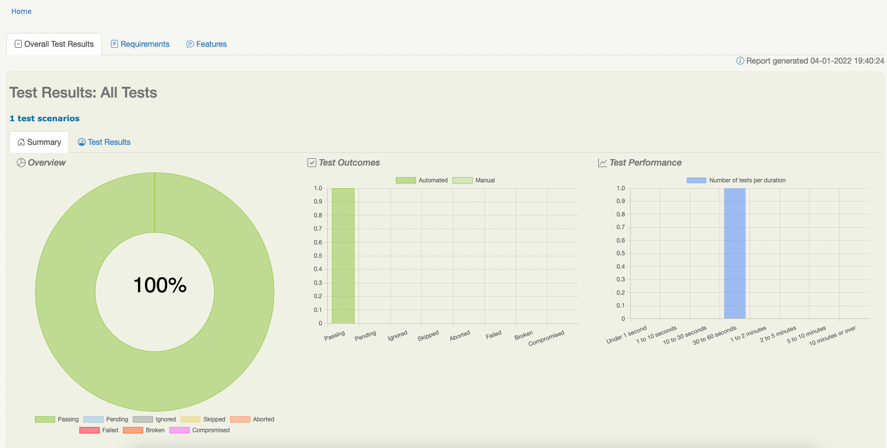
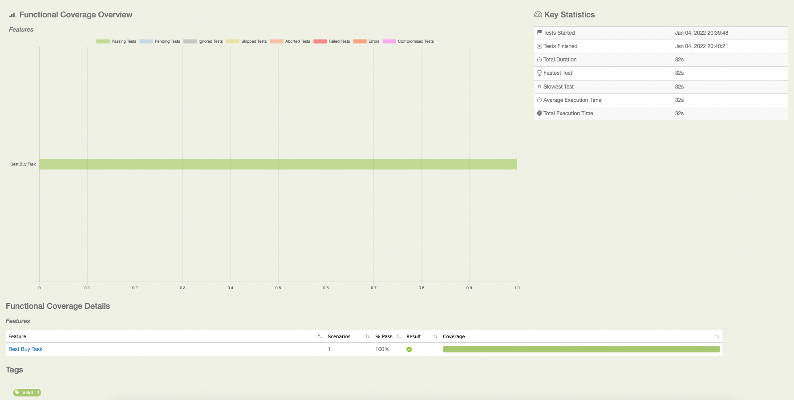
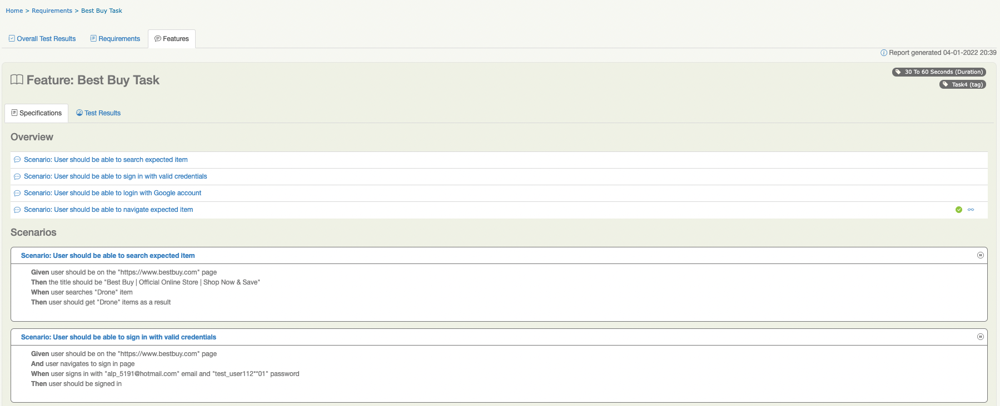
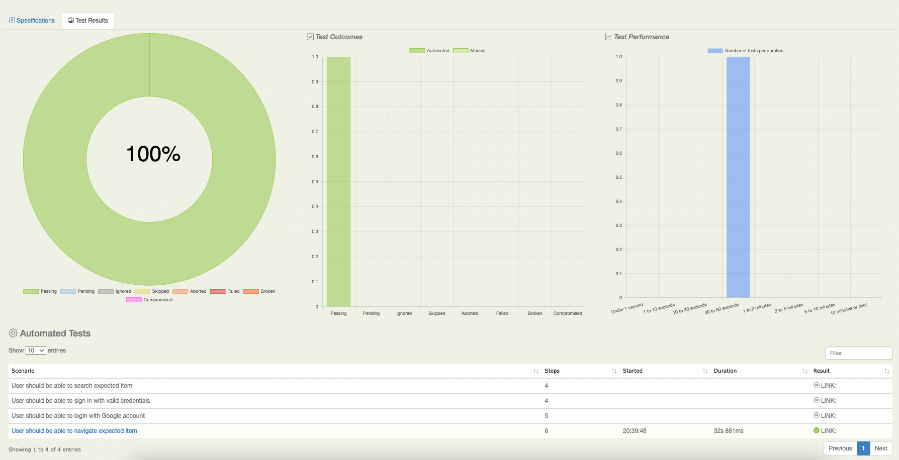

#This project used for Kloia Qa Task

##Rules:
The project should be shared in a git repository  
● Page Object Model (POM) approach should be used  
● You can use any tool stack (Eg: Java, Ruby, Python etc.) except record & play  
● Each execution should generate a HTML report  
● Project structure can be suitable for different browsers  
● README.md file should be added  
● Project can be run on the Command line 

`resolve conflicts`
- git add . (stage changes)
- git commit -m "message" (commit)
- git push (and push it to github)
- open pull request

`get serenity report`
- mvn clean verify

`page object class`
- BaseClass extends PageObject abstract class which comes with Serenity itself
- PageInitialize class initialize the page objects
- BaseClass runs these objects with the method which initializes with @Before annotation in test every run
- BrowserUtils class has ready methods and also extends PageInitialize class

`steps`

Serenity Step Libraries
In Serenity, tests are broken down into reusable steps. An important principle behind Serenity is the idea that it is easier to maintain a test that uses several layers of abstraction to hide the complexity behind different parts of a test.

In an automated acceptance test, test steps represent the level of abstraction between the code that interacts with your application (for example, Page Objects in an automated web test, which are designed in terms of actions that you perform on a given page) and higher-level stories (sequences of more business-focused actions that illustrate how a given user story has been implemented). If your automated test is not UI-oriented (for example, if it calls a web service), steps orchestrate other more technical components such as REST clients. Steps can contain other steps, and are included in the Serenity reports. Whenever a step is executed, a screenshot is stored and displayed in the report.

Breaking down tests into steps
Suppose we are testing a Frequent Flyer programme, and need to illustrate the following business rules:

- Members should start with Bronze status

- Members should earn Silver status after flying 10,000 km.

Each of these can be broken down further into business tasks and verifications. For example, the first rule could be broken into two steps:

1. Create a new Frequent Flyer member

2. Check that the member has a status of Bronze

Second can be broken into three steps:

1. Create a new Frequent Flyer member

2. Make the member fly 10000 km

3. Check that the member has a status of Silver

`featues`

Features grouped in folders based on module names. Once created a feature, associate it with a Jira issue by using tags: @PT2323.Feature file are usually created per feature of the application.
Try to make steps reusable as much as possible:

And user navigates to Programs

In this phrase, `Programs` is a parameter that Cucumber shows as a `{word}` in step definition.

```java
   public class StepDefinitions {

    @Steps
    BestBuySteps steps;

    @Given("user should be on the {word} page")
    public void userShouldBeOnThePage(String url) {
        steps.userShouldBeOnTheExpectedPage(url);
    }

    @Then("the title should be {word}")
    public void theTitleShouldBe(String title) {
        steps.pageTitleIsExpected(title);
    }
}
```

`step defintions`

Here we store code implementations. Please don't use page objects here, instead use @Steps:
```java
 public class StepDefinitions {

    @Steps
    BestBuySteps steps;

    @Given("user should be on the {string} page")
    public void userShouldBeOnThePage(String url) {
        steps.userShouldBeOnTheExpectedPage(url);
    }

    @Then("the title should be {string}")
    public void theTitleShouldBe(String title) {
        steps.pageTitleIsExpected(title);
    }
}
```
`page classes`

Please use *WebElementFacade* instead of *WebElement* and *ListOfWebElementFacades* instead of List\<WebElement\>.
These are the in-built Serenity wrapper classes that can help to make our life easier.

`WebElementFacade`
```java
public class BestBuyPage extends BrowserUtils {
    private static final Logger logger = Logger.getLogger(BestBuyPage.class);

    @FindBy(xpath = "(//*[normalize-space()='United States'])[1]")
    private WebElementFacade selectUnitedStates;
}
```

`report`




